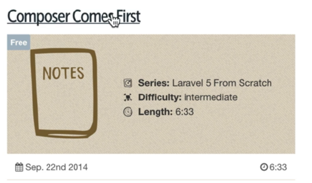
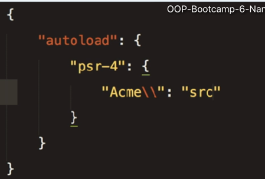

@(laravel-面向对象基础)[面向对象基础|laravel框架准备知识]

------
# 1. Classes

> Naturally, the first step in our journey is to review the structure of a PHP class. As you'll find, they allow us to represent pieces of our domain in a readable and flexible fashion.

- Class基础
    - 属性
    - 方法
- vedios from dropbox.com
    - **OOP-Bootcamp-1-Classes.mp4**
- Github links
    - [demo.class.php][demo.class.php]

[demo.class.php]:https://github.com/hackingangle/php/blob/master/demo.class.php

------
# 2. Getters and Setters

> When I was first learning, I had a lot of trouble understanding the need for getters and setters. Hopefully, I can make it easier for you, than it was for me!

- 类属性值改变
    - setter
    - getter
- vedios from dropbox.com
    - **OOP-Bootcamp-2-Getters-and-Setters.mp4**
- Github links
    - [demo.setter_getter.php][demo.setter_getter.php]

[demo.setter_getter.php]:https://github.com/hackingangle/php/blob/master/demo.setter_getter.php

------
# 3. Encapsulation

> Encapsulation is a confusing, scary term, that simply refers to the act of hiding information. Let me show you.

- 封装权限
    - private属性不可被外部直接访问
    - 通过公共方法setter和getter来访问
- vedios from dropbox.com
    - **OOP-Bootcamp-3-Encapsulation.mp4**
- Github links
    - [demo.encapsulation.php][demo.encapsulation.php]

[demo.encapsulation.php]:https://github.com/hackingangle/php/blob/master/demo.encapsulation.php

------
# 4. Inheritance

> Luckily, inheritance is a fairly easy concept to understand. I'll show you a few different examples to illustrate this common pattern.

- 继承
    - 不应被实例化的类用**abstract**指定
    - 子类一定要继承且覆盖实现的方法用**abstract**指定
- vedios from dropbox.com
    - **OOP-Bootcamp-4-Inheritance.mp4**
- Github links
    - [demo.inheritance.php][demo.inheritance.php]

[demo.inheritance.php]:https://github.com/hackingangle/php/blob/master/demo.inheritance.php

------
# 5. Messages

> The key to OOP is undestanding that objects send messages to one another. So far, we've exclusively worked with single classes, but that's not even remotely indicative of a real-world application. So, let's take a step up the latter, and talk about communication.

- Messages-类之间交互数据
    - 实例区分
- vedios from dropbox.com
    - **OOP-Bootcamp-5-Messages.mp4**
- Github links
    - [demo.messages.php][demo.messages.php]

[demo.messages.php]:https://github.com/hackingangle/php/blob/master/demo.messages.php

------
# 6. Namespacing and Autoloading

> Though not directly related to OOP, it's important that we take a short break to discuss such topics as namespacing and autoloading. These are core concepts that you must learn.

- namespacing, autoloading and psr4
    - composer
        - 
        - composer.json定义如下
            - 
    - 命名空间
        - `\`代表绝对路径，否则为相对于当前空间的
        - `use`默认据对路径

- vedios from dropbox.com
    - **OOP-Bootcamp-6-Namespacing-Autoloading-and-PSR4.mp4**
- Github links
    - [demo.namespace_autload_psr4][demo.namespace_autload_psr4]

[demo.namespace_autload_psr4]:https://github.com/hackingangle/php/tree/master/demo.namespace_autoload_psr4

------
# 7. Statics and Constants

> You've likely come across an article on the web, which stated that statics are evil. What do they mean by this? Is it true? Well...partially. Let's talk about it in this episode.

- Statics and Constants
    - statics
        - 内存存储分布
            - 对象-堆内存
            - 对象引用-栈内存
            - 静态成员-初始化静态段
                - 可以被堆内存中每个对象`共享`
                - 类`第一次加载`时，放置到初始化静态段中
        - 被不同的实例对象共享
    - constants
        - 不能使用`$`
        - 不在类中使用`define('MAX', 100)`定义
- vedios from dropbox.com
    - **OOP-Bootcamp-7-Statics-and-Constants.mp4**
- Github links
    - [demo.statics_constants.php][demo.statics_constants.php]

[demo.statics_constants.php]:https://github.com/hackingangle/php/blob/master/demo.statics_constants.php

------
# 8. Interfaces

> Appreciating the benefits of coding to an interface took me a very, very long time. This video will be step one on your journey. Watch it multiple times.

- Interfaces
    - 定义一个约定，两个实现
    - 使用者只需更换实现即可完成约定的切换
- vedios from dropbox.com
    - **OOP-Bootcamp-8-Interfaces.mp4**
- Github links
    - [demo.interfaces.php][demo.interfaces.php]

[demo.interfaces.php]:https://github.com/hackingangle/php/blob/master/demo.interfaces.php

------
# 9. Interfaces vs. Abstract Classes

> When I was first learning OOP, I very quickly became confused by interfaces and abstract classes. What is the difference between the two? How do I decide which is appropriate for any given situation?

- Interfaces vs. Abstract Classes
- vedios from dropbox.com
    - **OOP-Bootcamp-9-Interface-versus-Abstract.mp4**
- Github links

------
# 10. A Review

> I want to impress upon you that developers, at all times, have multiple ways to solve any particular problem. In certain contexts, one approach might be preferred, while in other situations, it very much might be the wrong approach. The key is to measure the pros and cons as best as you can.
In this episode, we'll review many of the terms that you've learned in this series.

- A Review
- vedios from dropbox.com
    - **OOP-Bootcamp-10-Review.mp4**
- Github links
    - [demo.review][demo.review]

[demo.review]:https://github.com/hackingangle/php/tree/master/demo.review
